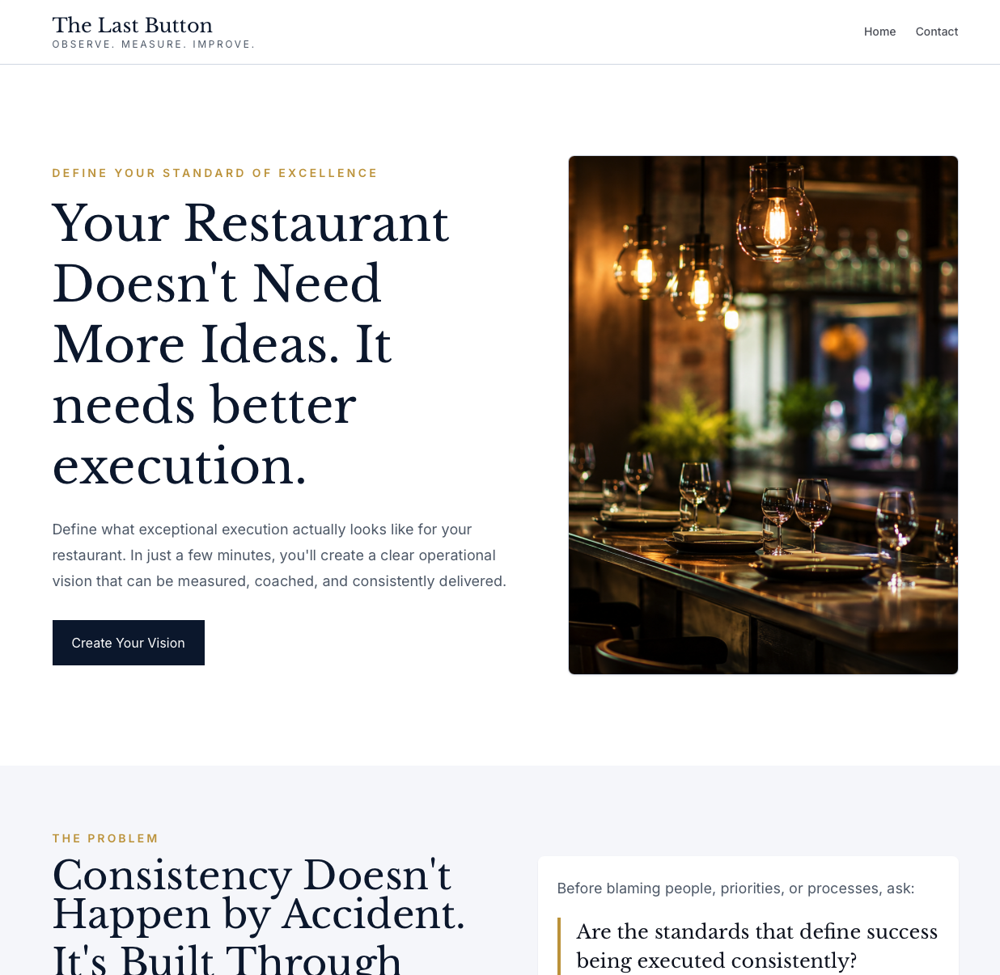
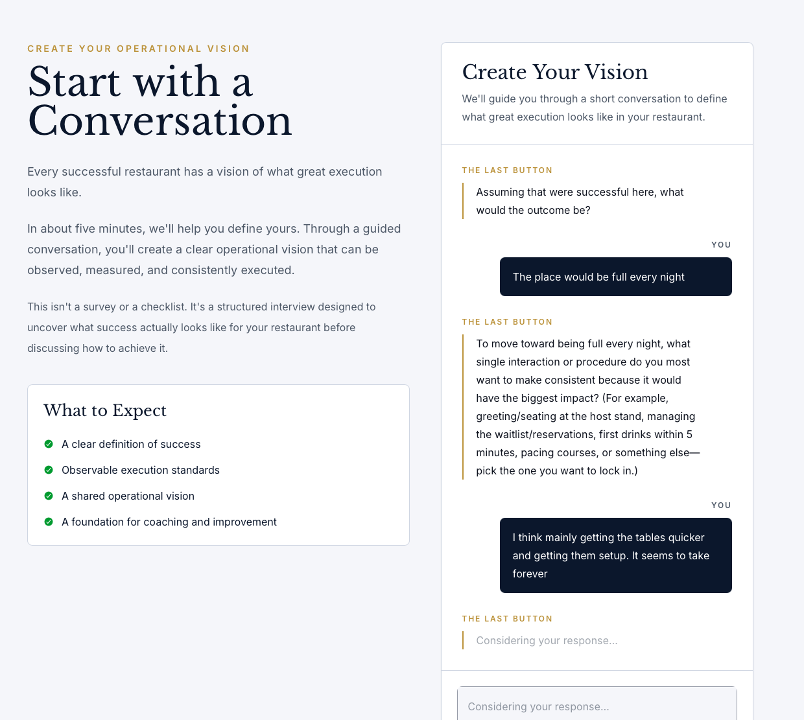
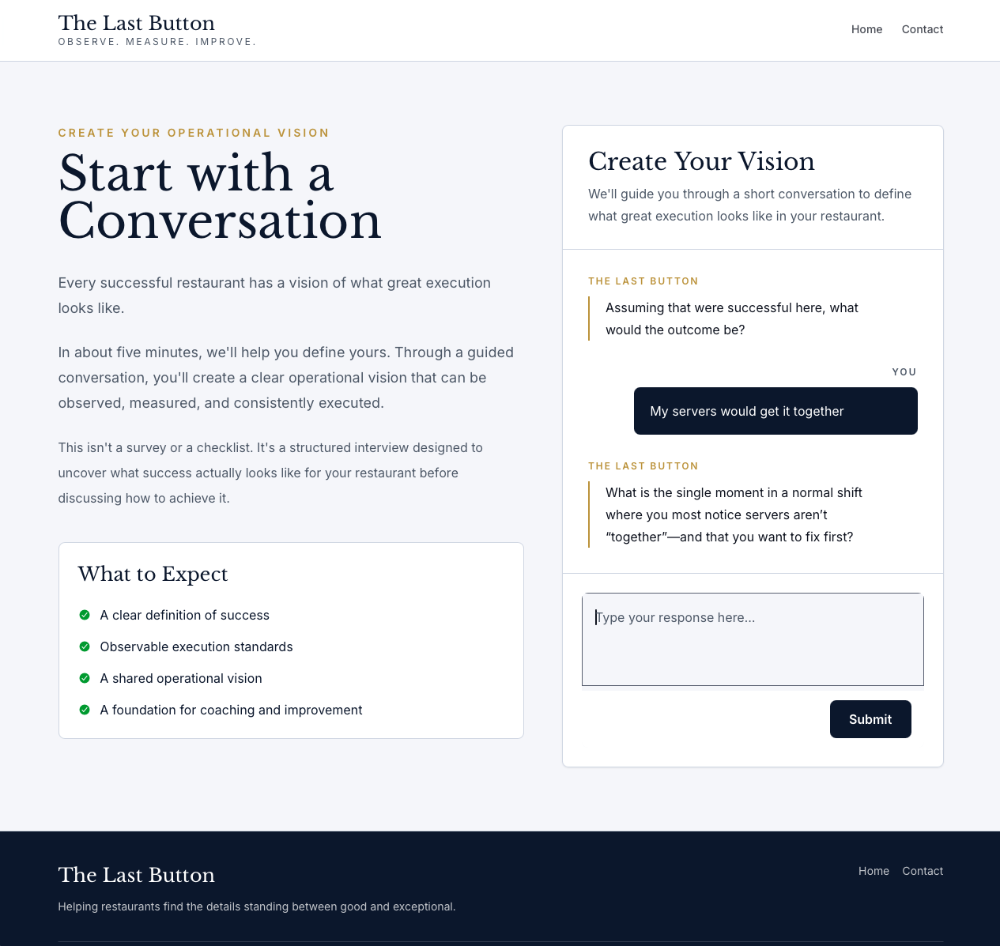
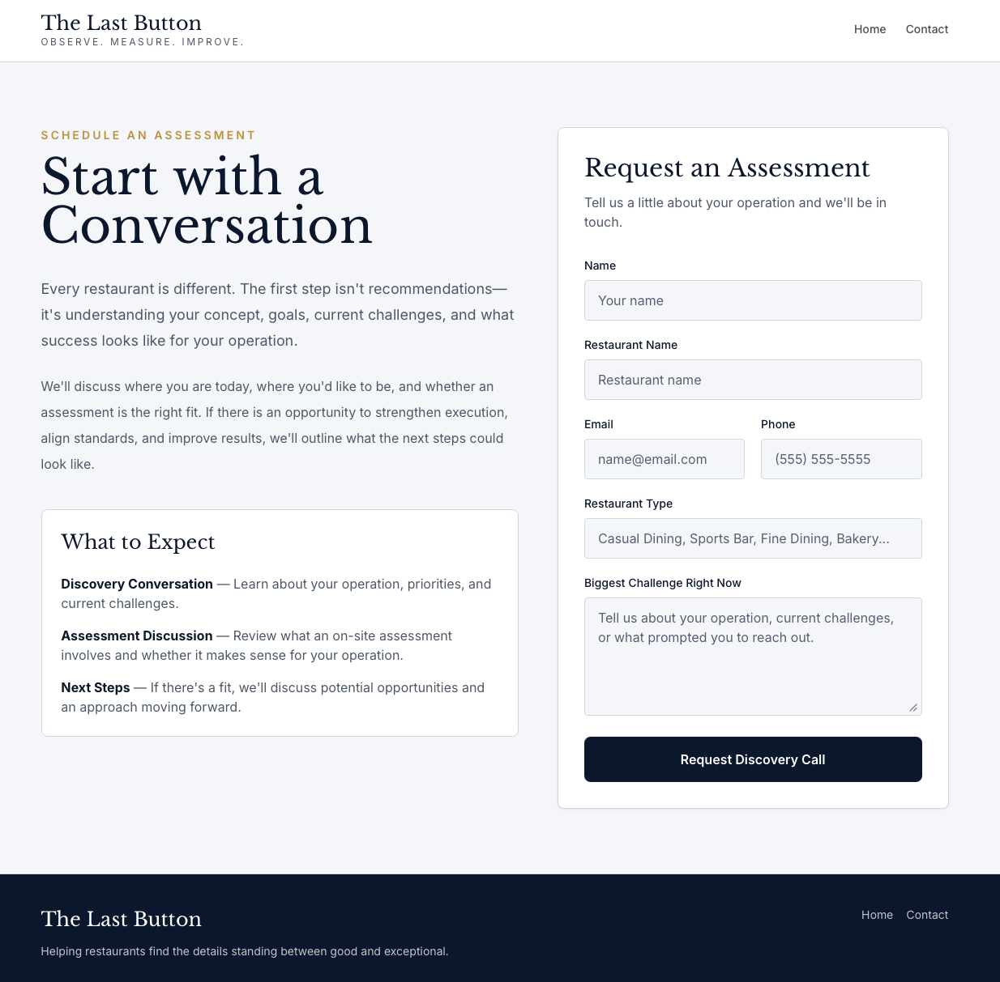

# The Last Button

> Observe. Measure. Improve.

The Last Button is an AI-assisted restaurant consulting platform built around the **Constructional Interview** methodology.

Rather than generating generic recommendations, the platform guides restaurant owners through a structured interview that defines what successful execution actually looks like before discussing solutions.

---

<h2 align="center">Landing Page</h2>

<p align="center">
  
</p>

<h2 align="center">Constructional Interview</h2>

<p align="center">
  
</p>

<p align="center">
  
</p>

<h2 align="center">Contact</h2>

<p align="center">
  
</p>

---

## Overview

The application consists of four primary pieces:

```
Restaurant Owner
        │
        ▼
SvelteKit Client
        │
        ▼
API Gateway
        │
        ▼
Interview Lambda
        │
        ▼
Constructional Interview MCP Server
        │
        ▼
OpenAI Responses API
```

The client is intentionally thin.

Its responsibility is simply to:

- display the conversation
- submit user responses
- render the completed operational vision

The interview itself is performed entirely by the backend.

---

# Constructional Interview

flowchart TB
CI["Constructional Interview<br/>AI Methodology Platform"]

    subgraph PLATFORM[" "]
        direction TB
        CI

        RESOURCES["Interview Resources"]
        PROMPTS["Prompt Engineering"]
        METHOD["Methodology"]
        EVAL["Evaluation"]
        TOOLS["AI Tools"]
        WORKFLOWS["AI Workflows"]

        CI --> RESOURCES
        CI --> PROMPTS
        CI --> METHOD
        CI --> EVAL
        CI --> TOOLS
        CI --> WORKFLOWS
    end

    CA["Constructional Affection<br/><br/>Behavior Analysis<br/><br/>Schemas<br/>Instructions<br/>Terminology<br/>UI<br/>Persistence<br/>Infrastructure"]

    LB["The Last Button<br/><br/>Restaurant Operations<br/><br/>Schemas<br/>Instructions<br/>Terminology<br/>UI<br/>Persistence<br/>Infrastructure"]

    CI -->|"consumes methodology + tools"| CA
    CI -->|"consumes methodology + tools"| LB

    classDef platform fill:#1f2937,color:#ffffff,stroke:#9ca3af,stroke-width:1.5px;
    classDef app fill:#f8fafc,color:#0f172a,stroke:#94a3b8,stroke-width:1.5px;

    class CI,RESOURCES,PROMPTS,METHOD,EVAL,TOOLS,WORKFLOWS platform;
    class CA,LB app;

Neither application owns the interview methodology.

The Constructional Interview platform exposes the reusable methodology, resources, tools, and workflows. Each consuming application supplies its own domain schemas, terminology, instructions, user experience, persistence, and infrastructure.

The interview is driven by an MCP resource describing the Constructional Interview methodology.

Instead of embedding prompts directly inside the Lambda, the Lambda requests the methodology from the MCP server before generating the next interview step.

```
Interview Lambda
        │
        ▼
getConstructionalGoalAnalysis()
        │
        ▼
MCP Resource
        │
        ▼
Constructional Interview Methodology
        │
        ▼
OpenAI Responses API
```

Because the methodology lives inside MCP resources rather than application code:

- prompts remain consistent
- methodology can evolve independently
- multiple applications can consume the same interview resource
- evaluation versions can be introduced without changing client code

The resource acts as the authoritative specification for how interviews should be conducted.

---

# Vision Interview

The interview gradually refines an operational vision by asking increasingly specific questions.

Rather than immediately recommending solutions, the interview narrows the problem until success can be described in observable terms.

Typical progression:

1. Desired outcome
2. Highest-impact interaction
3. Observable behavior
4. Context
5. Measurable execution standard

Only after the operational vision is complete does the platform transition into assessment and coaching.

---

# Technology

- SvelteKit
- TypeScript
- Tailwind CSS
- AWS CDK
- API Gateway
- Lambda
- EventBridge
- CloudFront
- S3
- Cognito
- MCP Server
- OpenAI Responses API

---

# Repository Structure

```
client/
    SvelteKit application

domain/
    Shared schemas and types

infra/
    AWS CDK infrastructure

lambdas/
    Interview handlers

mcp/
    Constructional Interview MCP server

data/
    Images and documentation used by the project
```

---

# Local Development

Install dependencies

```bash
npm install
```

Run the client

```bash
npm run dev -w client
```

Build the repository

```bash
npm run build
```

Deploy infrastructure

```bash
npm run deploy -w infra
```

---

# Philosophy

The Last Button is built on one assumption:

> Restaurants rarely fail because they lack ideas.
>
> They fail because great execution has never been clearly defined.

The purpose of the interview is to produce that definition.

Once success can be observed, it can be measured.

Once it can be measured, it can be coached.
